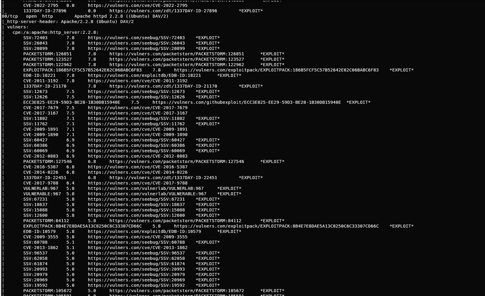
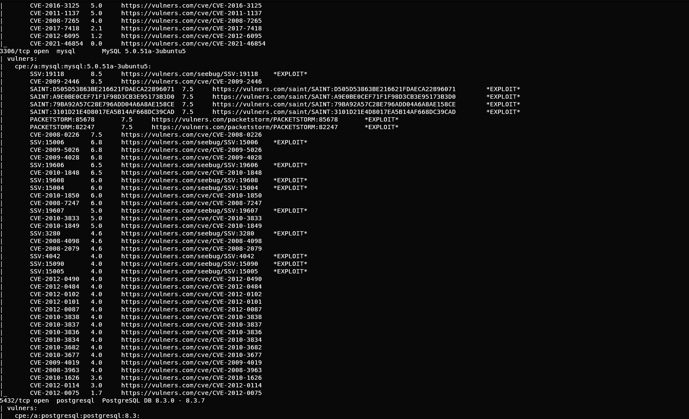
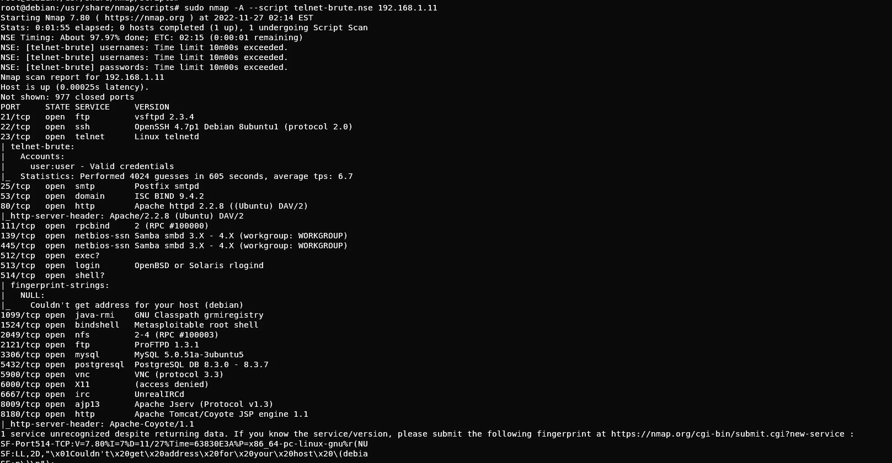
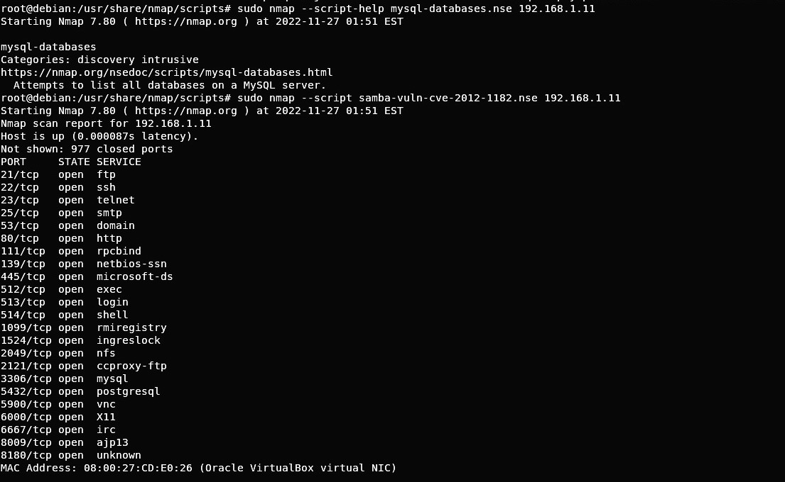

# Домашнее задание к занятию 13.1 "Уязвимости и атаки на информационные системы" - `Горбачев Олег`

### Задание 1.
Скачайте и установите виртуальную машину Metasploitable: https://sourceforge.net/projects/metasploitable/

Это типовая ОС для экспериментов в области информационно безопасности, с которой следует начать при анализе уязвимостей.

Просканируйте эту ВМ, используя nmap.

Попробуйте найти уязвимости, которым подвержена данная виртуальная машина.

Сами уязвимости можно поискать на сайте https://www.exploit-db.com/.

Для этого нужно в поиске ввести название сетевой службы, обнаруженной на атакуемой машине, и выбрать подходящие по версии уязвимости.

*Ответьте на следующие вопросы:*

*Какие сетевые службы в ней разрешены?
*Какие уязвимости были вами обнаружены? (список со ссылками: достаточно 3х уязвимостей)
*Приведите ответ в свободной форме.
___

### Ответ:
сканирую nmap на уязвимости ip Metasploitable 192.168.1.11

ссылки https://vulners.com/ либо  https://www.exploit-db.com/ видно на фото 

и еще сканирование 

Список сетевых служб 

и ссылки 
https://www.exploit-db.com/exploits/17491

https://www.exploit-db.com/exploits/15449

https://www.exploit-db.com/exploits/37721

### Задание 2.
Проведите сканирование Metasploitable в режимах SYN, FIN, Xmas, UDP.

Запишите сеансы сканирования в Wireshark.

Ответьте на следующие вопросы:

Чем отличаются эти режимы сканирования с точки зрения сетевого трафика?
Как отвечает сервер?
Приведите ответ в свободной форме.
___

### Ответ:
**Чем отличаются эти режимы сканирования с точки зрения сетевого трафика?**

Судя по всему wireshark трафик отличается флагами в случае сканирования TCP портов, так SYN сканирование  не до каонца устанавливает соединение, т.к. флаг FIN отсутсвует в таком трафике. 

Трафик при UDP сканировании выгляит совсем иначе, так в случае закрытого порта, в ответ приходит ICMP ошибка.

*Как отвечает сервер?*

Не во всех режимах сканирования гарантировано определяется открыт порт или фильтруется, только в случае SYN это можно определить точно. Опять же при сканировании UDP определяются только UDP порты.
